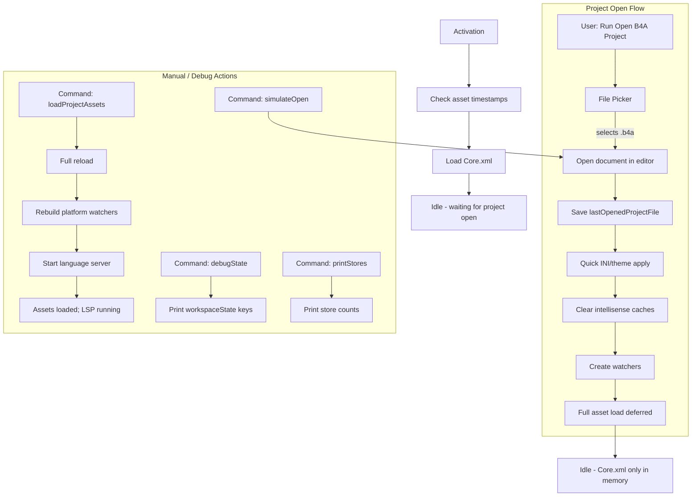

## Post-Project-Open Flow

```mermaid
flowchart TD
  A[Activation] --> A1[Check asset timestamps]
  A1 --> A2[Load Core.xml]
  A2 --> Ready[Idle - waiting for project open]

  subgraph OpenFlow [Project Open Flow]
    direction TB
    U[User: Run Open B4A Project] --> Picker[File Picker]
    Picker -->|selects .b4a| OpenDoc[Open document in editor]
    OpenDoc --> UpdateState[Save lastOpenedProjectFile]
    UpdateState --> QuickApply[Quick INI/theme apply]
    QuickApply --> ClearIS[Clear intellisense caches]
    ClearIS --> Watchers[Create watchers]
    Watchers --> Deferred[Full asset load deferred]
  end

  Deferred --> IdleAfterOpen[Idle - Core.xml only in memory]

  subgraph Manual [Manual / Debug Actions]
    direction TB
    Simulate[Command: simulateOpen] --> OpenDoc
    LoadAssets[Command: loadProjectAssets] --> FullReload[Full reload]
    FullReload --> RebuildWatchers[Rebuild platform watchers]
    RebuildWatchers --> StartLSP[Start language server]
    StartLSP --> Loaded[Assets loaded; LSP running]

    DebugState[Command: debugState] --> Console[Print workspaceState keys]
    PrintStores[Command: printStores] --> Console2[Print store counts]
  end

  %% Notes removed to ensure compatibility with Mermaid previewer

```

Open `docs/post-project-open.md` in VS Code and use a Mermaid preview extension or the built-in preview to view the diagram.
